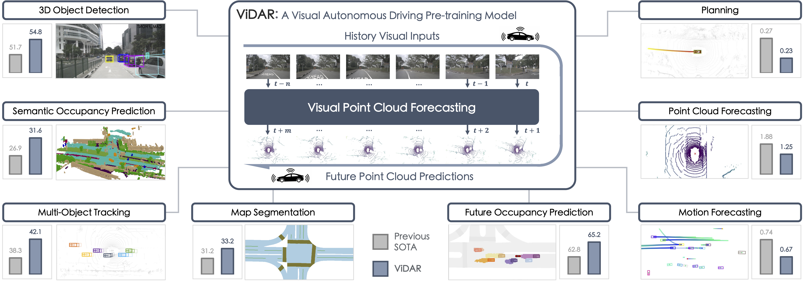
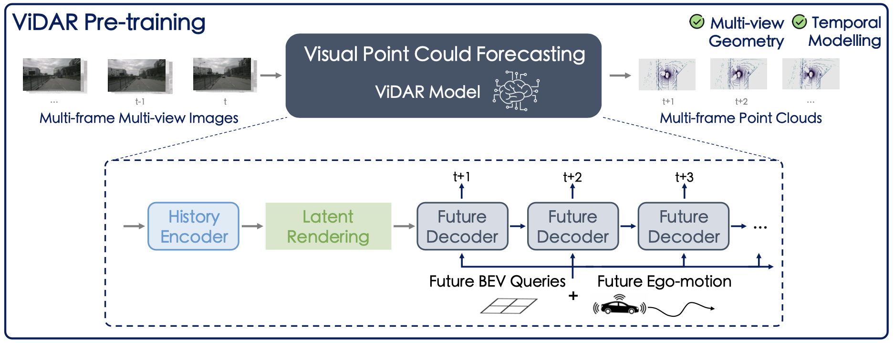

# ViDAR: Visual Point Cloud Forecasting



> **Visual Point Cloud Forecasting enables Scalable Autonomous Driving [CVPR 2024]**
>
> `Autonomous Driving Challenge 2024` **Predictive World Model** is [activated](docs/CHALLENGE.md)!
>
> [Zetong Yang](https://scholar.google.com/citations?user=oPiZSVYAAAAJ&hl=en), [Li Chen](https://scholar.google.com/citations?user=ulZxvY0AAAAJ&hl=en&authuser=1), [Yanan Sun](https://scholar.google.com/citations?user=6TA1oPkAAAAJ&hl=en), and [Hongyang Li](https://lihongyang.info/)
> 
> - Presented by [OpenDriveLab](https://opendrivelab.com/) and Shanghai AI Lab
> - :mailbox_with_mail: Primary contact: [Zetong Yang]((https://scholar.google.com/citations?user=oPiZSVYAAAAJ&hl=en)) ( tomztyang@gmail.com ) 
> - [arXiv paper](https://arxiv.org/abs/2312.17655) | [Blog TODO]() | [Slides TODO]()
> - [CVPR 2024 Autonomous Deiving Challenge - Predictive World Model](https://opendrivelab.com/challenge2024/#predictive_world_model)


## Highlights <a name="highlights"></a>

:fire: **Visual point cloud forecasting**, a new self-supervised pre-training task for end-to-end autonomous driving, predicting 
future point clouds from historical visual inputs, joint modeling the 3D geometry and temporal dynamics for simultaneous perception, prediction, and planning.

:star2: **ViDAR**, the first visual point cloud forecasting architecture.



:trophy: Predictive world model, in the form of visual point cloud forecasting, will be a main track in the `CVPR 2024 Autonomous Driving Challenge`. Please [stay tuned](https://opendrivelab.com/AD24Challenge.html) for further details!

## News <a name="news"></a>

- `[2024/3]` :fire: Predictive world model challenge is launched. Please refer to the [link](docs/CHALLENGE.md) for more details.
- `[2024/2]` ViDAR code and models initially released.
- `[2024/2]` ViDAR is accepted by CVPR 2024.
- `[2023/12]` ViDAR [paper](https://arxiv.org/abs/2312.17655) released.

## TODO List <a name="TODO List"></a>

Still in progress:
- [x] ViDAR-nuScenes-1/8 training and BEVFormer fine-tuning configurations.
- [ ] ViDAR-OpenScene-mini training configurations. (Welcome joining [predictive world model challenge](https://opendrivelab.com/challenge2024/#predictive_world_model)!)
- [ ] ViDAR-nuScenes-full training and downstream fine-tuning configurations. (Stay tuned due to limited resources for reproducing results currently)


## Table of Contents

1. [Results and Model Zoo](#models)
2. [Installation](#installation)
3. [Prepare Datasets](#prepare-datasets)
4. [Train and Evaluate](#train-and-evaluate)
5. [License and Citation](#license-and-citation)
6. [Related Resources](#resources)

## Results and Model Zoo <a name="models"></a>

### Visual point cloud forecasting pre-training

**NuScenes Dataset:**

|  Pre-train Model | Dataset  | Config | CD@1s | CD@2s | CD@3s | models & logs |
| :------: | :---: | :---: | :----: | :----: | :----: | :----: |
|   ViDAR-RN101-nus-1-8-1future | nuScenes (12.5% Data)   |  [vidar-nusc-pretrain-1future](projects/configs/vidar_pretrain/nusc_1_8_subset/vidar_1_8_nusc_1future.py)  |  -   | - | - |  [models](https://drive.google.com/file/d/1NrJ49fFJaIPtnM9mfP_OsomY8AydMlNx/view?usp=sharing) / [logs](https://drive.google.com/file/d/1_80pYnhAHk7ZAiDMJKJW7_jXKGylZ3-D/view?usp=sharing) |
|   ViDAR-RN101-nus-1-8-3future | nuScenes (12.5% Data)   |  [vidar-nusc-pretrain-3future](projects/configs/vidar_pretrain/nusc_1_8_subset/vidar_1_8_nusc_3future.py)  |  1.25   | 1.48 | 1.79 |  [models](https://drive.google.com/file/d/1FR5lZGIA2KBzg-CsERDegNCuRNrMJsmR/view?usp=sharing) / [logs](https://drive.google.com/file/d/1HeiTGv8ss3fT2wCrFyzSGWwHbn7IR0mH/view?usp=sharing) |

**OpenScene Dataset:**

|  Pre-train Model | Dataset  | Config | CD@1s | CD@2s | CD@3s | models & logs |
| :------: | :---: | :---: | :----: | :----: | :----: | :----: |
|   ViDAR-RN101-OpenScene-3future | OpenScene-mini (12.5% Data)   |  [vidar-OpenScene-pretrain-1future](projects/configs/vidar_pretrain/OpenScene/vidar_OpenScene_mini_1_8_3future.py)  |  1.41   | 1.57 | 1.78 |  [models](https://drive.google.com/file/d/1aai3Z7JZavtDAFYzY1pwe41MNNRO_Wn_/view?usp=sharing) / [logs](https://drive.google.com/file/d/1oHdLH11l_ik2M5KyJBtklxa5Skz1bVra/view?usp=sharing) |
|   ViDAR-RN101-OpenScene-3future | OpenScene-mini-Full (100% Data)   |  [vidar-OpenScene-pretrain-3future](projects/configs/vidar_pretrain/OpenScene/vidar_OpenScene_mini_full_3future.py)  |  TODO   | TODO | TODO |  [models]() / [logs]() |

### Down-stream fine-tuning
| Downstream Model | Dataset |  pre-train | Config | NDS | mAP | models & logs |
| :------: | :------: | :---: | :---: | :----: | :----: | :----: |
| BEVFormer-Base (baseline) | nuScenes (25% Data) |  [FCOS3D](https://github.com/zhiqi-li/storage/releases/download/v1.0/r101_dcn_fcos3d_pretrain.pth)  | [bevformer-base](projects/configs/vidar_finetune/nusc_1_4_subset/bevformer_1_4_baseline.py)  |  43.40   | 35.47 | [models](https://drive.google.com/file/d/19FKge9dANm7qG_hb1WRmokS3svWiMhE4/view?usp=sharing) / [logs](https://drive.google.com/file/d/1YwvW-ON6hHM4tLyWpo-orVUTXErRAfsu/view?usp=sharing) |
| BEVFormer-Base | nuScenes (25% Data) |   [ViDAR-RN101-nus-1-8-1future](projects/configs/vidar_pretrain/nusc_1_8_subset/vidar_1_8_nusc_1future.py)   | [vidar-nusc-finetune-1future](projects/configs/vidar_finetune/nusc_1_4_subset/vidar_1_8_nusc_1future.py)  |  45.77   | 36.90 | [models](https://drive.google.com/file/d/1t-SQUf41QcVOnyQk2TaSu7MBYcTqA_sf/view?usp=sharing) / [logs](https://drive.google.com/file/d/1Mq99JK_wATQdz6iwUPlN9YAtraB_HgjJ/view?usp=sharing) |
| BEVFormer-Base | nuScenes (25% Data) |   [ViDAR-RN101-nus-1-8-3future](projects/configs/vidar_pretrain/nusc_1_8_subset/vidar_1_8_nusc_3future.py)   | [vidar-nusc-finetune-3future](projects/configs/vidar_finetune/nusc_1_4_subset/vidar_1_8_nusc_3future.py)  |  45.61   | 36.84 | [models](https://drive.google.com/file/d/1D6yogBruaIcItgU-dPQt8qCPrDmxin5i/view?usp=sharing) / [logs](https://drive.google.com/file/d/1f7LiYp2hP64KnJzpDjj6JfK6lC4GtIly/view?usp=sharing) |

## Installation <a name="installation"></a>

The installation step is similar to [BEVFormer](https://github.com/fundamentalvision/BEVFormer/blob/master/docs/install.md).
For convenience, we list the steps below:
```bash
conda create -n vidar python=3.8 -y
conda activate vidar

pip install torch==1.10.1+cu111 torchvision==0.11.2+cu111 torchaudio==0.10.1 -f https://download.pytorch.org/whl/cu111/torch_stable.html
conda install -c omgarcia gcc-6 # (optional) gcc-6.2
```

Install mm-series packages.
```bash
pip install mmcv-full==1.4.0
pip install mmdet==2.14.0
pip install mmsegmentation==0.14.1

# Install mmdetection3d from source codes.
git clone https://github.com/open-mmlab/mmdetection3d.git
cd mmdetection3d
git checkout v0.17.1 # Other versions may not be compatible.
python setup.py install
```

Install Detectron2 and Timm.
```bash
pip install einops fvcore seaborn iopath==0.1.9 timm==0.6.13  typing-extensions==4.5.0 pylint ipython==8.12  numpy==1.19.5 matplotlib==3.5.2 numba==0.48.0 pandas==1.4.4 scikit-image==0.19.3 setuptools==59.5.0
python -m pip install 'git+https://github.com/facebookresearch/detectron2.git'
```

Setup ViDAR project.
```bash
git clone https://github.com/OpenDriveLab/ViDAR

cd ViDAR
mkdir pretrained
cd pretrained & wget https://github.com/zhiqi-li/storage/releases/download/v1.0/r101_dcn_fcos3d_pretrain.pth

# Install chamferdistance library.
cd third_lib/chamfer_dist/chamferdist/
pip install .
```

## Prepare Datasets <a name="prepare-datasets"></a>

- [OpenScene](https://github.com/OpenDriveLab/OpenScene): please refer to [HERE](docs/DATASET.md).
- [nuScenes](https://www.nuscenes.org/): please refer to [HERE](docs/DATASET.md#nuscenes).


## Train and Evaluate <a name="train-and-evaluate"></a>

### Train

We recommand using 8 A100 GPUs for training. The GPU memory usage is around 63G while pre-training.
* **HINT**: To save GPU memory, you can change *supervise_all_future=True* to *False*, and use a smaller *vidar_head_pred_history_frame_num* and
*vidar_head_pred_future_frame_num*.
For example, by setting `supervise_all_future=False`, `vidar_head_pred_history_frame_num=0`, `vidar_head_pred_future_frame_num=0`,
and `vidar_head_per_frame_loss_weight=(1.0,)`, 
the GPU memory consumption of [vidar-pretrain-3future-model](projects/configs/vidar_pretrain/nusc_1_8_subset/vidar_1_8_nusc_3future.py) is reduced to ~34G.
An example configuration is provided at [link](projects/configs/vidar_pretrain/nusc_1_8_subset/mem_efficient_vidar_1_8_nusc_3future.py).


```bash
CONFIG=path/to/config.py
GPU_NUM=8

./tools/dist_train.sh ${CONFIG} ${GPU_NUM}
```

### Evaluate

```bash
CONFIG=path/to/vidar_config.py
CKPT=path/to/checkpoint.pth
GPU_NUM=8

./tools/dist_test.sh ${CONFIG} ${CKPT} ${GPU_NUM}
```

### Visualize

```bash
CONFIG=path/to/vidar_config.py
CKPT=path/to/checkpoint.pth
GPU_NUM=1

./tools/dist_test.sh ${CONFIG} ${CKPT} ${GPU_NUM} \
  --cfg-options 'model._viz_pcd_flag=True' 'model._viz_pcd_path=/path/to/output'
```


## License and Citation <a name="license-and-citation"></a>

All assets and code are under the [Apache 2.0 license](./LICENSE) unless specified otherwise.

If this work is helpful for your research, please consider citing the following BibTeX entry.

``` bibtex
@inproceedings{yang2023vidar,
  title={Visual Point Cloud Forecasting enables Scalable Autonomous Driving},
  author={Yang, Zetong and Chen, Li and Sun, Yanan and Li, Hongyang},
  booktitle={Proceedings of the IEEE/CVF Conference on Computer Vision and Pattern Recognition},
  year={2024}
}
```

## Related Resources <a name="resources"></a>

We acknowledge all the open-source contributors for the following projects to make this work possible:

- [BEVFormer](https://github.com/fundamentalvision/BEVFormer) | [UniAD](https://github.com/OpenDriveLab/UniAD) | [4D Occ](https://github.com/tarashakhurana/4d-occ-forecasting)

<a href="https://twitter.com/OpenDriveLab" target="_blank">
    
  </a>

- [DriveAGI](https://github.com/OpenDriveLab/DriveAGI) | [Survey on BEV Perception](https://github.com/OpenDriveLab/BEVPerception-Survey-Recipe) | [Survey on E2EAD](https://github.com/OpenDriveLab/End-to-end-Autonomous-Driving)
- [BEVFormer](https://github.com/fundamentalvision/BEVFormer) | [UniAD](https://github.com/OpenDriveLab/UniAD) | [OpenLane-V2](https://github.com/OpenDriveLab/OpenLane-V2) | [OccNet](https://github.com/OpenDriveLab/OccNet)
